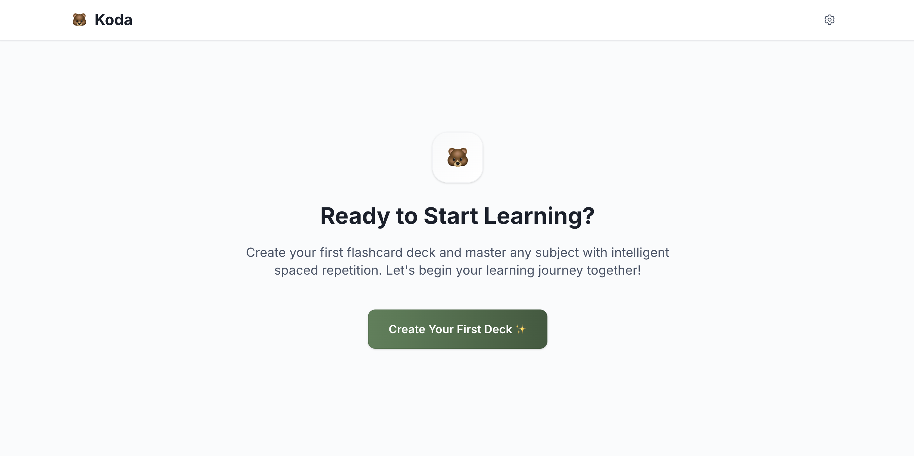
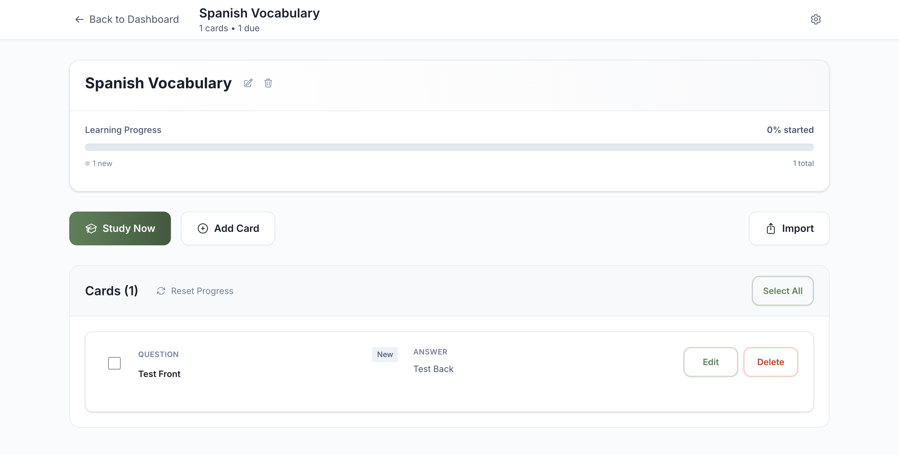
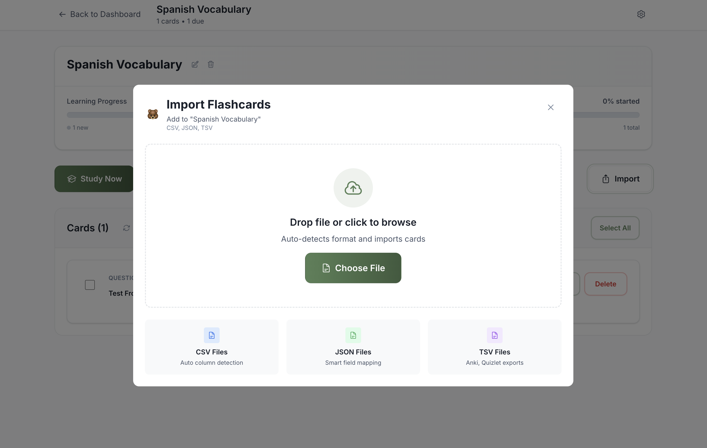
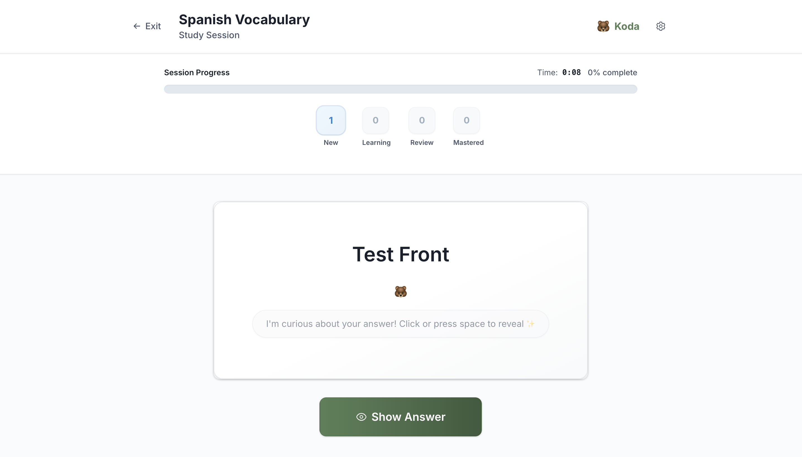

# 🐻 Koda - Simple Flashcard App

A minimalistic flashcard application with spaced repetition, featuring Koda the bear as your study companion. Works entirely in demo mode with localStorage - no backend required for local use.

## Screenshots






## ✨ Features

- **Smart Spaced Repetition**: Custom algorithm that adapts to learning patterns
- **Demo Mode**: Fully functional with localStorage - no setup required
- **Beautiful Design**: Clean UI with Koda bear mascot integration
- **File Import**: Support for CSV, JSON, TXT, and popular flashcard formats
- **Responsive Design**: Works perfectly on desktop and mobile
- **Zero Configuration**: Just clone and run

## 🏗️ Tech Stack

- **React 18 + TypeScript**: Modern frontend framework
- **Tailwind CSS**: Utility-first styling
- **Zustand**: Lightweight state management
- **Vite**: Fast development and building
- **localStorage**: Demo mode data persistence

### Optional Production Backend
- **Vercel Serverless API**: Node.js + TypeScript functions
- **PostgreSQL + Prisma**: For production database

## 🚀 Quick Start

### Prerequisites
- Node.js 18+ and npm

### 1. Install Dependencies
```bash
# Install all dependencies
npm run install:all
```

### 2. Start Development
```bash
# Start the development server
npm run dev

# Runs on http://localhost:5173
```

### 3. Start Using
1. Visit http://localhost:5173
2. Create your first deck immediately - works in demo mode!
3. Add flashcards and start studying
4. All data is saved to localStorage automatically

**Note**: The app automatically runs in demo mode when no backend is available. Perfect for local development and demonstration.

## 📁 Project Structure

```
Koda 2.0/
├── client/                 # React frontend application
│   ├── src/
│   │   ├── components/     # Reusable UI components
│   │   ├── pages/          # Page components
│   │   ├── stores/         # Zustand state management
│   │   ├── services/       # API client with demo mode
│   │   └── utils/          # Utility functions
│   └── public/             # Static assets
├── api/                    # Optional: Vercel serverless functions
├── prisma/                 # Optional: Database schema for production
└── package.json           # Build scripts and backend dependencies
```

## 🛠️ Development Commands

```bash
npm run dev             # Start development server (demo mode)
npm run build           # Build for production
npm run install:all     # Install all dependencies
```

## 🚢 Production Deployment (Optional)

The app works perfectly in demo mode, but for production with data persistence:

### Vercel Deployment
1. Deploy to [vercel.com](https://vercel.com) - auto-detects configuration
2. Set `DATABASE_URL` environment variable for PostgreSQL
3. The app will automatically switch from demo mode to backend mode

### Demo Mode vs Production
- **Demo Mode**: Uses localStorage, perfect for development/demos
- **Production Mode**: Uses PostgreSQL database with user data persistence

---

Made by Ben Rückert
